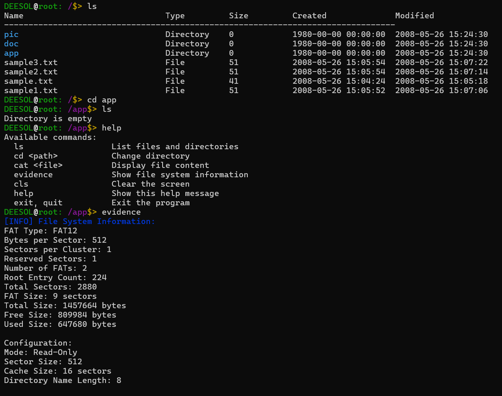
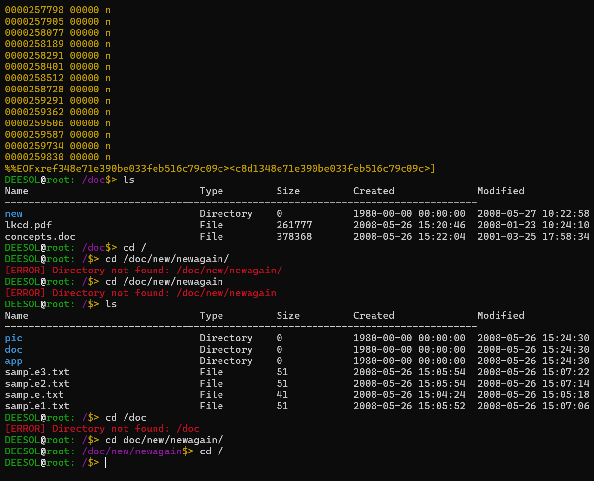
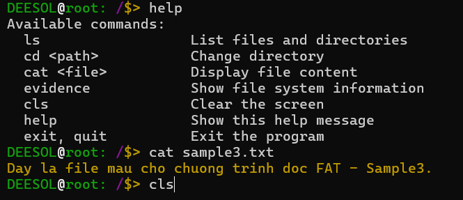

# FAT File System Project

## 1. Tổng Quan Kiến Trúc

### 1.1 Mục tiêu:

* Xây dựng một ứng dụng C chạy trên Windows nhằm đọc và xử lý file **floppy.img**.
* Mô phỏng giao tiếp phần cứng thông qua các thao tác trên file bằng cách triển khai hai tầng driver chính:

  ***FAT Driver**: Xử lý logic của hệ thống tệp FAT (File Allocation Table), quản lý các thao tác liên quan đến cấu trúc file system.

  ***IP Driver**: Thực hiện các thao tác I/O cấp thấp trên file bằng các hàm chuẩn như **fopen**, **fread**, **fseek**, **fwrite**, và **fclose**.

### 1.2 Luồng dữ liệu tổng thể:

Dữ liệu được truyền qua các tầng theo thứ tự sau:

**Application → Middleware → FAT Driver → HAL → IP Driver (File I/O)**

Và ngược lại, dữ liệu từ file **floppy.img** được đọc qua IP Driver, xử lý qua các tầng và đưa lên Application để hiển thị hoặc sử dụng.

### 1.3 Cấu trúc thư mục dự án:

Dự án được tổ chức theo cách module hóa với các thư mục con trong **src**:

```text

project

  └── src

       ├── application

       │     ├── application.h

       │     └── application.c

       ├── common

       │     └── common_types.h

       ├── fat_driver

       │     ├── fat_driver.h

       │     ├── fat_driver.c

       │     ├── fat_driver_private.h

       │     └── fat_driver_types.h

       ├── hal

       │     ├── hal.h

       │     └── hal.c

       ├── ip_driver

       │     ├── ip_driver.h

       │     └── ip_driver.c

       ├── middleware

       │     ├── middleware.h

       │     └── middleware.c

       └── utilities

             └── linkedlist

                   ├── linkedlist.h

                   └── linkedlist.c

```

---

## 2. Chi Tiết Các Lớp

### 2.1. IP Driver Layer

#### 2.1.1 Chức năng chính:

* Là tầng thấp nhất, trực tiếp tương tác với file **floppy.img**.
* Cung cấp các hàm để mở file, đọc dữ liệu, ghi dữ liệu (nếu cần), và đóng file.
* Thực hiện các thao tác I/O dựa trên **offset** (vị trí cụ thể) và **size** (kích thước dữ liệu) được yêu cầu từ tầng trên.

#### 2.1.2 Các hàm chính:

***ip_driver_init(const char *img_path)**:

* Mở file **floppy.img** bằng **fopen** (chế độ **"r+b"** để hỗ trợ cả đọc và ghi).
* Kiểm tra lỗi mở file và lưu con trỏ file vào biến toàn cục hoặc cấu trúc quản lý.
* Ví dụ:

  ```c

  FILE *file =fopen(img_path,"r+b");

  if(!file)return-1; // Lỗi mở file

  ```

***ip_driver_read(unsigned int offset, unsigned char *buffer, size_t size)**:

* Sử dụng **fseek** để di chuyển con trỏ file đến offset được chỉ định.
* Dùng **fread** để đọc **size** byte dữ liệu từ offset đó vào **buffer**.
* Trả về số byte đọc được hoặc mã lỗi nếu thất bại.
* Ví dụ:

  ```c

  fseek(file, offset, SEEK_SET);

  size_t bytes_read =fread(buffer,1, size, file);

  return(bytes_read == size)?0:-1;

  ```

***ip_driver_write(unsigned int offset, const unsigned char *buffer, size_t size)**:

* Sử dụng **fseek** để di chuyển con trỏ file đến offset được chỉ định.
* Dùng **fwrite** để ghi **size** byte dữ liệu từ **buffer** vào file tại offset đó.
* Trả về mã lỗi nếu ghi thất bại.
* Ví dụ:

  ```c

  fseek(file, offset, SEEK_SET);

  size_t bytes_written =fwrite(buffer,1, size, file);

  return(bytes_written == size)?0:-1;

  ```

***ip_driver_close()**:

* Đóng file bằng **fclose** và giải phóng tài nguyên.
* Ví dụ:

  ```c

  if(file)fclose(file);

  ```

#### 2.1.3 Luồng xử lý:

1.**ip_driver_init()** mở file và kiểm tra trạng thái.

2. Các hàm **ip_driver_read()** và **ip_driver_write()** nhận offset và size từ tầng trên, thực hiện I/O tại vị trí tương ứng trên file, và kiểm tra lỗi.

3.**ip_driver_close()** kết thúc thao tác với file.

---

### 2.2. Hardware Abstraction Layer (HAL)

#### 2.2.1 Chức năng chính:

* Trừu tượng hóa các thao tác I/O từ IP Driver, cung cấp giao diện đơn giản cho tầng trên (FAT Driver).
* Ẩn chi tiết triển khai của IP Driver.

#### 2.2.2 Các hàm chính:

***hal_init(const char *img_path)**:

* Gọi **ip_driver_init()** để khởi tạo thao tác với file.

***hal_read_sector(unsigned int sector, unsigned char *buffer)**:

* Tính offset từ sector (offset = sector * sector_size) và gọi **ip_driver_read()**.
* Kiểm tra lỗi và trả về kết quả.

***hal_write_sector(unsigned int sector, const unsigned char *buffer)**:

* Tính offset tương tự và gọi **ip_driver_write()**.

***hal_configure()**:

* Thiết lập các tham số như kích thước sector (thường là 512 byte cho FAT12) hoặc số sector tối đa.

#### 2.2.3 Luồng xử lý:

* HAL nhận yêu cầu từ FAT Driver, chuyển đổi thành offset và size, gọi IP Driver để thực hiện đọc/ghi, và trả kết quả lên trên.

---

### 2.3. FAT Driver Layer

#### 2.3.1 Chức năng chính:

* Xử lý logic hệ thống tệp FAT12 (thường dùng cho đĩa floppy) trên **floppy.img**.
* Đọc cấu trúc boot sector, bảng FAT, thư mục gốc (root directory) và dữ liệu file.
* Chuyển đổi yêu cầu từ Middleware thành thao tác sector qua HAL.

#### 2.3.2 Các hàm chính:

***fat_driver_init()**:

* Gọi **hal_init()** để khởi tạo.
* Đọc sector 0 (boot sector) để lấy thông tin: bytes/sector, sectors/cluster, số FAT, kích thước root directory, v.v.

***fat_driver_read_file(const char *filename, unsigned char *buffer)**:

* Tìm file trong thư mục gốc hoặc thư mục con.
* Lấy cluster bắt đầu từ mục nhập thư mục.
* Theo dõi chuỗi cluster trong bảng FAT để đọc toàn bộ dữ liệu file qua HAL.

***fat_driver_list_directory(const char *path, linkedlist_t *file_list)**:

* Đọc các mục nhập trong thư mục gốc hoặc thư mục con.
* Lưu thông tin (tên file, kích thước, thuộc tính) vào danh sách liên kết **file_list**.

#### 2.3.3 Luồng xử lý:

1. Khởi tạo: Đọc boot sector để thiết lập thông số FAT12.
2. Liệt kê thư mục: Đọc sector chứa thư mục, phân tích mục nhập và lưu vào danh sách.
3. Đọc file: Tìm mục nhập file, theo dõi chuỗi cluster, đọc từng sector qua HAL và tổng hợp dữ liệu.

---

### 2.4. Middleware Layer

#### 2.4.1 Chức năng chính:

* Xử lý dữ liệu từ FAT Driver, chuyển đổi thành dạng phù hợp để Application sử dụng.
* Thực hiện logic nghiệp vụ (ví dụ: định dạng dữ liệu, kiểm tra lỗi).

#### 2.4.2 Các hàm chính:

***middleware_init()**:

* Gọi **fat_driver_init()** để thiết lập kết nối với FAT Driver.

***middleware_process_data()**:

* Nhận dữ liệu từ FAT Driver (ví dụ: nội dung file) và xử lý (phân tích, định dạng).

***middleware_get_info()**:

* Trả về thông tin như danh sách file hoặc nội dung file cho Application.

***middleware_event_handler()**:

* Xử lý sự kiện hoặc lỗi (ví dụ: file không tồn tại) và thông báo cho Application.

#### 2.4.3 Luồng xử lý:

* Middleware nhận yêu cầu từ Application, gọi FAT Driver, xử lý dữ liệu và trả kết quả.

---

### 2.5. Application Layer

#### 2.5.1 Chức năng chính:

* Cung cấp giao diện người dùng (giả sử CLI đơn giản) và điều phối hoạt động giữa các tầng.
* Hiển thị kết quả và nhận lệnh từ người dùng.

#### 2.5.2 Các hàm chính:

***app_init()**:

* Gọi **middleware_init()** để khởi tạo toàn bộ hệ thống (đi qua các tầng đến IP Driver).

***app_run()**:

* Chạy vòng lặp chính: hiển thị menu (ví dụ: "1. List directory, 2. Read file"), nhận lệnh và xử lý.

***app_handle_input()**:

* Xử lý lệnh người dùng, gọi **middleware_get_info()** để lấy dữ liệu và hiển thị.

***app_exit()**:

* Gọi các hàm dọn dẹp qua các tầng, cuối cùng đóng file qua **ip_driver_close()**.

#### 2.5.3 Luồng xử lý mẫu:

```c

#include"application.h"


intmain(void){

    app_init(); // Khởi tạo hệ thống

    app_run();  // Chạy vòng lặp chính

    app_exit(); // Dọn dẹp và thoát

    return0;

}

```

---

### 2.6. Utilities Layer

#### 2.6.1 Chức năng chính:

* Cung cấp các công cụ hỗ trợ, như danh sách liên kết, để các tầng khác sử dụng.

#### 2.6.2 Các hàm mẫu cho linkedlist:

***llist_init()**: Khởi tạo danh sách rỗng.

***llist_add_node()**: Thêm node chứa dữ liệu (ví dụ: thông tin file).

***llist_remove_node()**: Xóa node khỏi danh sách.

***llist_destroy()**: Giải phóng bộ nhớ.

---

## 3. Luồng Chương Trình Toàn Cục

***Vòng lặp hoạt động**:

  ***app_run()** hiển thị menu và nhận lệnh (ví dụ: liệt kê thư mục, đọc file).

* Application gọi Middleware → FAT Driver → HAL → IP Driver để đọc dữ liệu.
* Dữ liệu được xử lý ngược lên và hiển thị cho người dùng.

***Kết thúc**:

  ***app_exit()** dọn dẹp tài nguyên qua các tầng, cuối cùng đóng file.

---

## 4. Makefile và Quản Lý Dự Án

### Makefile mẫu:

```makefile

# Makefile cho FAT File System Project


# Công cụ build

CC        := C:\cygwin64\bin\gcc.exe

RM        := rm -rf

MKDIR     := mkdir -p


# Thư mục

ROOT_DIR  := .

SRC_DIR   :=$(ROOT_DIR)/src

BUILD_DIR:=$(ROOT_DIR)/build

OBJ_DIR   :=$(BUILD_DIR)/obj

BIN_DIR   :=$(BUILD_DIR)/bin

DEP_DIR   :=$(BUILD_DIR)/dep

IMAGE_DIR:=$(ROOT_DIR)/images


# Các file nguồn

SRCS:=$(shell find $(SRC_DIR) -type f -name "*.c")


# Tạo danh sách file object tương ứng

OBJS:=$(SRCS:$(SRC_DIR)/%.c=$(OBJ_DIR)/%.o)


# Tạo danh sách file dependency

DEPS:=$(SRCS:$(SRC_DIR)/%.c=$(DEP_DIR)/%.d)


# Cờ biên dịch

INC_DIRS:=$(SRC_DIR)\

            $(SRC_DIR)/common \

            $(SRC_DIR)/ip_driver \

            $(SRC_DIR)/hal \

            $(SRC_DIR)/fat_driver \

            $(SRC_DIR)/middleware \

            $(SRC_DIR)/application \

            $(SRC_DIR)/utilities/linkedlist \

            $(SRC_DIR)/utilities/log


INC_FLAGS:=$(addprefix -I,$(INC_DIRS))


CFLAGS:= -Wall -Wextra -Werror \

          -Wno-unused-parameter \

          -Wno-unused-variable \

          -Wno-unused-function \

          -Wno-maybe-uninitialized \

          -std=c11 \

          -fdiagnostics-color=always \

          -g \

          -O2 \

          -MMD -MP \

          $(INC_FLAGS)


LDFLAGS:= -lm -lpthread -v


# File đích

TARGET:=$(BIN_DIR)/$(PROJECT_NAME).exe


# File ảnh

IMAGE_FILE:=$(wildcard $(subst \\,/,$(IMAGE_DIR))/*.img)


# Chế độ

BUILD_MODE?= release

MODE?= read-only


# Các target

.PHONY: all clean run debug release help


# Target mặc định

all: release


# Build bản release (có tối ưu)

release: CFLAGS += -O2 -DNDEBUG

release:$(TARGET)

    @echo "Build release hoàn thành"


# Build bản debug

debug: CFLAGS += -g -DDEBUG

debug:$(TARGET)

    @echo "Build debug hoàn thành"


# Build file thực thi

$(TARGET): $(OBJS) | $(BIN_DIR)

    @echo "Linking $@..."

    @$(CC)$(OBJS)$(LDFLAGS) -o $@

    @echo "Build hoàn thành!"


# Compile các file nguồn

$(OBJ_DIR)/%.o: $(SRC_DIR)/%.c | $(OBJ_DIR)

    @echo "Compiling $<..."

    @$(MKDIR)$(dir$@)

    @$(MKDIR)$(dir $(DEP_DIR)/$*.d)

    @$(CC)$(CFLAGS) -c $< -o $@


# Tạo các thư mục cần thiết

$(BIN_DIR)$(OBJ_DIR):

    @$(MKDIR)$@


# Clean

clean:

    @echo "Cleaning..."

    @$(RM)$(BUILD_DIR)

    @echo "Clean hoàn thành!"


# Run

run:$(TARGET)

    @echo "Running $(TARGET)"

    @./$(TARGET)$(IMAGE_FILE)$(MODE)


# Print

print-%:

    @echo $* = $($*)


# Help

help:

    @echo"Cáctargetcósẵn:"

    @echo "  all      - Build tất cả (mặc định)"

    @echo "  release  - Build bản release"

    @echo "  debug    - Build bản debug"

    @echo "  clean    - Xóa các file build"

    @echo "  run      - Chạy chương trình"

    @echo "  help     - Hiển thị help này"

    @echo "  print-%  - In giá trị của biến"


# Include dependency files

-include$(DEPS)

```

---

## 5. Lưu Ý Khi Triển Khai

***Mô phỏng phần cứng**: Tất cả thao tác I/O đều qua file **floppy.img**, không liên quan đến phần cứng thật.

***Kiểm tra lỗi**: Mỗi hàm cần kiểm tra và báo lỗi (ví dụ: **fopen** thất bại, đọc/ghi lỗi).

***Tính module hóa**: Các tầng chỉ giao tiếp qua API, đảm bảo thay đổi tầng dưới không ảnh hưởng tầng trên.

***Kiểm thử**: Viết unit test cho từng tầng (IP Driver: đọc/ghi dữ liệu; FAT Driver: liệt kê file, v.v.).

***Hiệu suất**: Cân nhắc caching trong Middleware nếu cần xử lý nhiều dữ liệu.

## 6. Hình ảnh chạy thực tế








---

**Tóm tắt**: Phần **IP Driver Layer** đã được sửa lại để làm rõ vai trò của nó là một tầng I/O cấp thấp, chỉ làm việc với offset và size, không hiểu khái niệm sector. Các tầng khác trong kiến trúc vẫn giữ nguyên chức năng, với HAL đảm nhận vai trò chuyển đổi từ sector sang offset để giao tiếp với IP Driver. Ứng dụng vẫn đảm bảo tính module hóa, rõ ràng và dễ mở rộng.
